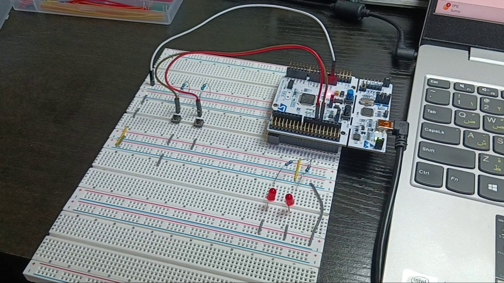

# Multiple External Interrupts

## Overview

This project demonstrates how to handle multiple external interrupts sharing the same interrupt line on the STM32 NUCLEO-L476RG development board.

Two push buttons are connected to PA6 and PA7. Both pins use the shared EXTI9_5 interrupt vector (EXTI9_5_IRQn). Two LEDs connected to PA11 and PA12 respond independently to the interrupts generated by the push buttons.

Pressing Push Button 1 toggles LED 1, while pressing Push Button 2 toggles LED 2.

The system clock is configured to run at 80 MHz.

## Hardware

- STM32 NUCLEO-L476RG Development Board
- 2 × Push Buttons
- 2 × LEDs
- Current Limiting Resistors
- Breadboard
- Jumper Wires

## Pin Connections

| Function | STM32 Pin |
|----------|-----------|
| Push Button 1 | PA6 |
| Push Button 2 | PA7 |
| LED 1 | PA11 |
| LED 2 | PA12 |

## Interrupt Configuration

### EXTI Configuration

- EXTI Line 6
- EXTI Line 7
- Shared interrupt vector: EXTI9_5_IRQn
- NVIC interrupt enabled
- Falling-edge trigger

## Features

- Multiple external interrupts
- Shared EXTI9_5 interrupt vector handling
- Interrupt source identification
- Push Button 1 toggles LED 1
- Push Button 2 toggles LED 2
- STM32 HAL-based implementation

## Project Structure

| Folder | Description |
|----------|-------------|
| Core | Application source and header files |
| Drivers | STM32 HAL and CMSIS drivers |
| Docs | Project documentation and schematic |
| Images | Hardware setup photos |

## Images

## Documentation

[Schematic PDF](Multi_Int/Docs/multi_int_schematic.pdf)

## Development Environment

- STM32CubeIDE
- STM32CubeMX
- STM32 HAL Drivers